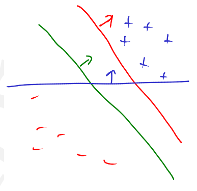

# *Classificadores Lineares*
## *Support Vector Machine*
*Neste capítulo, discutimos uma ferramenta de machine learning muito útil: o ***Support Vector Machine*** (SVM) para aprender preditores lineares em espaços de features de alta dimensão. ***A alta dimensionalidade do espaço de features aumenta tanto a complexidade da amostra quanto os desafios da complexidade computacional.*** O paradigma algorítmico SVM aborda o desafio da complexidade da amostra procurando por separadores de '***grande margem***'. ***Ou seja, um meio-espaço separa um conjunto de treinamento com uma grande margem se todos os exemplos não estiverem apenas no lado correto do hiperplano de separação/decisão, mas também longe dele.*** ***Restringir o algoritmo para produzir um separador de margem grande pode resultar numa pequena complexidade de amostra***, mesmo se a dimensionalidade do espaço de features for alta (e até infinita). Introduzimos o conceito de margem e relacionamo-lo com o paradigma de minimização de perdas regularizadas, bem como com a taxa de convergência do algoritmo do Perceptrão.*

*Vamos começar pensando no objetivo original dos classificadores lineares: encontrar um hiperplano que separe os exemplos de treino positivos dos negativos. A figura abaixo mostra alguns dados e três hiperplanos potenciais: vermelho, verde e azul. Qual você gosta mais? Provavelmente você escolheu o hiperplano verde. E provavelmente escolheu-o porque estava mais longe dos pontos de treinamento mais próximos. Em outras palavras, este tinha uma ***grande margem***. ***O desejo de hiperplanos com grandes margens é um exemplo perfeito de 'bias' indutivo.*** Os dados não nos dizem qual dos três hiperplanos é o melhor: temos que escolher um usando alguma outra fonte de informação. Seguindo essa linha de pensamento, chegamos à Support Vector Machine (SVM). ***Esta é simplesmente uma maneira de configurar um problema de otimização que tenta encontrar um hiperplano de separação com a maior margem possível:*** min ω, ϐ = 1 / ϒ(ω, ϐ); sujeito a yn(ω ∙ ϰn + ϐ) ≥ 1.*

****Nesta otimização, está a tentar-se encontrar parâmetros que maximizem a margem***, denotada por ϒ, (isto é, minimizem o recíproco da margem) ***sujeitos à restrição de que todos os exemplos de treino sejam classificados corretamente***.*

*A coisa 'estranha' sobre este problema de otimização é que exigimos que a classificação de cada ponto seja maior que um, em vez de simplesmente maior que zero. No entanto, o problema não muda fundamentalmente se você substituir o um por qualquer outra constante positiva.*

*Como representado acima, a constante pode ser interpretada visualmente garantindo que haja uma margem não trivial entre os pontos positivos e negativos.*

****A dificuldade com o problema de otimização é o que acontece com os dados que não são linearmente separáveis.*** Nesse caso, não existe um conjunto de parâmetros ω, ϐ que satisfaça simultaneamente todas as restrições. Em termos de otimização, diz-se que a região factível está vazia. (A região factível é simplesmente o conjunto de todos os parâmetros que satisfazem as restrições.) Por esse motivo, isso é chamado de SVM de margem rígida, porque impor a margem é uma restrição rígida.*

> ****Um problema de otimização na forma SVM standard*** (não depende nem de θ nem de γ separados mas apenas do rácio θ/γ), ***é um problema de  programação quadrática*** (o objetivo é quadrático nos parâmetros e ***as restrições säo lineares***).*

### *Vantagens do classificador de margem máxima:*
 - *A solução é única dado um conjunto de treino linearmente separável;*
 - *A solução de margem máxima, sendo ela a mais afastada possível dos exemplos (***samples***), torna-a robusta a exemplos (***samples***) ruidosos (embora não robusta a etiquetas (***labels***) ruidosas);*
 - *A solução de margem máxima depende apenas de um subconjunto dos exemplos (***samples***) de treino, nomeadamente, dos exemplos (***samples***) que se situam exatamente sobre a margem (as linhas a tracejado da figura abaixo). A esses exemplos (***samples***) dá-se o nome de vetores de suporte (representados por pequenas circunferências na figura abaixo).*

> ### *Propriedades do classificador de margem máxima:*
>  - ****Validação Cruzada***: ***consiste em ir retreinando o classificador com subconjuntos dos exemplos de treino, testando-o nos exemplos remanescentes como se não tivessem sido 'vistos antes'***.*
>   - *Um caso particular é o que se chama validação cruzada ***leave-one-out***: seleciona cada exemplo do conjunto de treino, um de cada vez, para ser o exemplo que fica de fora; treina-se o classificador com a totalidade dos exemplos remanescentes, e testa-se o classificador resultante no exemplo que ficou de fora; conta-se o número de erros obtidos.*
>     - *Um classificador com ***erro de validação cruzada leave-one-out baixo irá tendencialmente ter uma boa generalização*** embora tal não seja garantido.*
>     - *Para um classificador linear de máxima margem (SVM) ***o erro leave-one-out consiste em exemplos que estejam fora da margem serem bem classificados***, independentemente de serem, ou não, incluídos no treino.*
>         - ****Exemplos que sejam vetores de suporte***, pelo contrário, ***poderão ser mal classificados caso não sejam incluídos no treino*** (pois é com base neles que o separador linear é definido).*
>     - *Podemos então definir o seguinte ***majorante para o erro de validação cruzada leave-one-out:****
> 
>       $$ \text{erro de validação cruzada leave-one-out} \le \frac{\text{número de vetores de suporte}}{n} $$
> 
>      - *Podemos então concluir, então, que ***um número reduzido de vetores de suporte é vantajoso*** (é mais um argumento a favor do SVM).*
>      - *Existem também, naturalmente, ***desvantagens do SVM***. Por exemplo: ***apenas um exemplo mal classificado pode bastar para alterar radicalmente o classificador linear de máxima margem.****

### *A questão é: como modificar esse problema de otimização para que ele possa lidar com dados inseparáveis?*

****A ideia-chave é o uso de slack parameters.*** A intuição por trás dos slack parameters é a seguinte: Suponha que encontremos um conjunto de parâmetros ω, ϐ que façam um trabalho realmente bom em 9999 pontos de dados. Os pontos são perfeitamente classificados e consegue-se uma grande margem. Mas há um ponto de dados irritante que não pode ser colocado no lado correto da margem: talvez seja barulhento (***noisy***). Você quer ser capaz de fingir que pode "mover" aquele ponto através do hiperplano para o lado correto. Logo terá que "pagar" um pouco para fazer isso, mas desde que não mova muitos pontos, pode ser uma boa ideia fazer isso. Nesta imagem, a quantidade que você move: o ponto, é denotada ξ (ϰi).*

****Ao introduzir um slack parameter para cada exemplo*** (***sample***) de treino e penalizando-se a si mesmo por ter que usar um slack, pode-se criar uma função objetiva, ou seja, um ***SVM de margem flexível*** (relaxação).*

*O objetivo da função objetiva é garantir que todos os pontos sejam classificados corretamente (a primeira restrição). Mas se um ponto n não puder ser classificado corretamente, você poderá definir um slack para algo maior que zero de maneira a "movê-lo" na direção correta. No entanto, para todas os slack (parameters) diferentes de zero, você deve "pagar" na função objetiva proporcional ao valor do slack. ***O hiperparâmetro C > 0 controla overfitting versus underfitting*** (hard-margin vs soft-margin). ***A segunda restrição simplesmente diz que você não deve ter um slack negativo.****

****Uma grande vantagem do SVM de margem flexível sobre o SVM original de margem rígida é que a região factível nunca está vazia.*** Ou seja, haverá sempre alguma solução, independentemente se os dados de treino são linearmente separáveis ou não.*

*Uma coisa é anotar um problema de otimização. Outra coisa é tentar resolvê-lo. Há um número muito grande de maneiras de otimizar SVMs, essencialmente porque eles são um modelo de aprendizagem muito popular. Aqui, falaremos apenas sobre uma maneira muito simples.*

*Para progredir, é necessário medir o tamanho da margem. Suponha que alguém fornece os parâmetros ω, ϐ que otimizam o SVM de margem rígida. Queremos medir o tamanho da margem. ***A primeira observação é que o hiperplano ficará exatamente a meio caminho entre o ponto positivo mais próximo e o ponto negativo mais próximo.*** Caso contrário, a margem poderia ser aumentada simplesmente deslizando-a para um lado ou para o outro ***ajustando o bias***: ϐ.*

*The size of the margin is inversely proportional to the norm of the weight vector. Thus, maximizing the margin is equivalent to minimizing the weight vector. Having small weights means having large margins!*

****O tamanho da margem é inversamente proporcional à norma do vetor de weights.*** Assim, maximizar a margem é equivalente a minimizar o vetor de weights. Ter weights pequenos significa ter margens grandes!*

### *Hinge Loss*

*Vimos como podemos formular a procura de um separador de margem máxima quando se permite que alguns dos exemplos (samples) do conjunto de treino possam ser deliberadamente mal classificados. Essa formulação assume a forma de um problema simples de otimização obtido por soft-margin (relaxação) do problema de otimização anteriomente definido.*
 - *O parâmetro C (***quanto maior C menor é a soft-margin*** (relaxação) ***permitida***) pode ser determinado através de validação cruzada, ou seja, minimizando o erro de VC leave-one-out.*

*Pretendemos olhar para este problema de otimização com soft-margin (relaxação) do ponto de vista de regularização. ***Os problemas de regularização säo formulados***, tipicamente, ***como problemas de otimização envolvendo o objetivo desejado (funcäo perda na classificação) e um termo de penalização (termo de regularização)***.*
 - *Esta função de perda específica o custo de violar cada uma das restricöes de margem. Baseamo-nos na função ***hinge loss que é simplesmente max(1 — z, 0)*** e que podemos escrever como (1 — z).*

*Ou seja, ***para determinados valores de C, quando nenhuma restrição de margem é violada (perda zero) a penalização de regularização ajuda a selecionar a solução com a margem geométrica maior.****