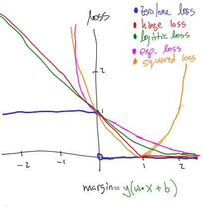

# *Decomposição de erro*
*Ao querermos obter um classificador podemos incorrer em dois tipos de erros:*
 - ****Erro de aproximação***: ***é o risco mínimo alcançável por um preditor na classe de hipótese.*** Este termo mede quanto risco temos porque nos restringimos a uma classe específica, ou seja, quanto bias indutivo temos. ***O erro de aproximação é independente do tamanho da amostra e é determinado pela classe de hipótese escolhida.*** Ampliar a classe de hipóteses pode diminuir o erro de aproximação. Sob a suposição de realizabilidade, o erro de aproximação é zero. No caso agnóstico, no entanto, o erro de aproximação pode ser grande.*
 - ****O erro de estimativa***: ***é a diferença entre o erro de aproximação e o erro obtido pelo preditor.*** Ou seja, o erro de estimativa ocorre porque o risco empírico (ou seja, erro de treino: medida de como as predições se estão a desviar dos verdadeiros valores de d) é apenas uma estimativa do risco verdadeiro e, portanto, o preditor que minimiza o risco empírico é apenas uma estimativa do preditor que minimiza o risco verdadeiro. ***A qualidade dessa estimativa depende do tamanho do conjunto de treinamento e do tamanho ou complexidade da classe de hipóteses.****

# *Regressão Linear*

*A ideia básica do perceptrão é executar um determinado algoritmo até que um separador linear seja encontrado. Você pode perguntar: existem algoritmos melhores para encontrar este separador linear? Seguiremos essa ideia e formularemos um problema de aprendizagem como um problema de otimização explícito: que encontre um separador linear que não seja muito complicado. Veremos que encontrar um separador "ideal" é, na verdade, computacionalmente proibitivo e, portanto, será necessário "relaxar" o requisito de otimização. ***Isso levar-nos-á a um objetivo convexo que combina uma função de perda*** (quão bem nos estamos saindo nos dados de treino) ***e um regularizador*** (quão complicado é nosso modelo aprendido). ***Essa estrutura de aprendizagem é conhecida como regularização de Tikhonov e minimização de risco estrutural.****

## *Estrutura de otimização de modelos lineares*

****Viu-se o perceptrão como uma forma de encontrar um vetor de weights ω e um bias ϐ; este método faz um bom trabalho em separar samples de treino positivas de samples de treino negativas.*** No entanto, o perceptrão é tanto um modelo como um algoritmo. Aqui, estamos interessados em separar estas questões. Vamo-nos concentrar em modelos lineares, como o perceptrão; Mas tentando pensar em formas mais genéricas de encontrar bons parâmetros para tais modelos. ***O objetivo do perceptrão é encontrar um hiperplano de separação para algum conjunto de dados de treino.*** Simplificando, pode-se ignorar a questão do overfitting (por agora).*

*Nem todos os conjuntos de dados são linearmente separáveis. ***No caso dos dados de treino não serem linearmente separáveis, pode-se querer encontrar um hiperplano que cometa menos erros.*** Podemos escrever isto como um problema formal de otimização matemática da seguinte forma:*

$$ min(\omega,b) \sum_{n}^{}[y_{n}(\omega\cdot x_{n} + b) \gt 0] $$

****Nesta expressão, está-se a optimizar duas variáveis, ω e ϐ.*** A função objetivo é a que se está a tentar minimizar. Neste caso, a função objetivo é simplesmente a ***taxa de erro*** (ou perda 0/1) ***do classificador linear parametrizado por ω, ϐ.*** Nesta expressão, o um e o produto escalar são a função indicadora: retorna um quando o produto escalar é verdadeiro e zero caso contrário. ***Sabemos que o algoritmo do perceptrão garante encontrar parâmetros para este modelo se os dados forem linearmente separáveis.*** Noutras palavras, se o ótimo da equação acima for zero, o perceptrão encontrará com eficiência os parâmetros do modelo. ***A noção de "eficiência" depende da margem dos dados do perceptrão***.*

***Existe um algoritmo eficiente para encontrar uma configuração ótima dos parâmetros? Infelizmente, a resposta é não.***

****Para tentar encontrar uma solução que generalize bem, de forma a testar os dados, é necessário garantir que não se superajuste os dados (overfitting).*** Para isso, deve-se introduzir um regularizador sobre os parâmetros do modelo. Por enquanto, seremos vagos sobre a aparência desse regularizador e simplesmente o denotaremos de função arbitrária:*

$$ R(\omega, b) $$

***Subsequentemente, tal função arbitrária será uma das loss functions substitutas.***

## *Regularização de weights*

*O que acontece se não temos um número suficiente de exemplos? O que acontece se os exemplos que temos são ruidosos? Para ter em conta essas duas circunstâncias utiliza-se a regularização. ***A regularização impede um fit perteito dos exemplos do conjunto de treino.*** Ou seja, os elementos de θ afastam-se de zero somente se tiverem uma razão suficientemente forte para isso.*

*No nosso objetivo de apredizagem, tínhamos um termo correspondente à perda zero/um nos dados de treino, além de um regularizador cujo objetivo era garantir que a função aprendida não ficasse muito "louca". (***Ou, mais formalmente, para garantir que a função não se superajuste (overfitting)***.)*

****Um desejo comum é que os componentes do vetor de weights sejam pequenos (próximos de zero). Esta é uma forma de bias indutivo.*** Ou seja, ao interpretar a derivada como a taxa de variação, podemos ver que a taxa de variação da função de previsão é proporcional aos weights individuais. Portanto, se se deseja que a função mude lentamente, é necessário certificar-se de que os weights permaneçem pequenos. Além de weights pequenos serem bons, pode-se argumentar que weights com valor zero são melhores. Se um weight vai para zero, isso significa que o feature (label) d não é usado na decisão de classificação. Se houver um grande número de features (labels) irrelevantes, pode-se querer que o máximo possível de weights chegue a zero.*

### *Hinge Loss*

****Funções convexas são boas porque são fáceis de minimizar.*** Intuitivamente, se "fizer porcaria" em qualquer lugar numa função convexa, ela chegará sempre ao seu mínimo. Isso não é verdade para funções não convexas; O que leva à ideia de loss functions substitutas convexas. Como a perda zero/um é difícil de otimizar, é desejado otimizar outra coisa. Como as funções convexas são fáceis de otimizar, queremos aproximar a perda de zero/um com uma função convexa. ***Essa função de aproximação será chamada de perda substituta. As perdas substitutas que construímos sempre serão limites superiores na função de perda real: isso garante que, se você minimizar a perda substituta, também estará diminuindo a perda real.****

*Existem quatro loss functions substitutas comuns, cada uma com suas próprias propriedades: hinge loss, logistic loss, exponential loss and squared loss.*

*Existem duas grandes diferenças nestas loss functions. A primeira diferença é o quão "chateadas" elas ficam com previsões errôneas. No caso da hinge loss e logistic loss, o crescimento da função conforme ela se torna negativa é linear. Para a square loss e exponential loss, é superlinear. ***Isso significa que a exponential loss prefere obter alguns samples um pouco erradas (mal classificadas) do que uma sample realmente errado (mal classificada).*** A outra diferença é como eles lidam com previsões corretas muito confiantes. ***Uma vez que y (predicted label) > 1 (positive), a hinge loss não se preocupa mais, mas logistical e exponential loss ainda acham que você pode fazer melhor.*** ***Por outro lado, a square loss considera tão errado prever +3 (positive) em numa sample positiva quanto prever -1 (negative) na mesma sample.****