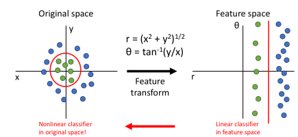
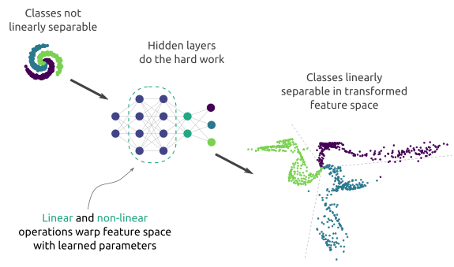
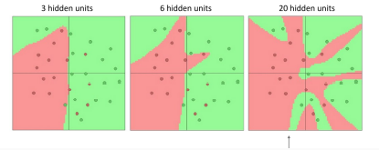
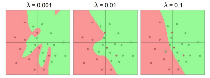

# *Redes Neuronais*
## *Transformação de features (labels)*
****A transformação de features refere-se à família de algoritmos que criam novas features usando as existentes.*** Estas novas features podem não ter a mesma interpretação das originais, mas podem ter mais poder discriminatório num espaço diferente do original. ***Este método é também usado para a redução de features.*** A transformação de features pode acontecer de várias maneiras, por combinações simples/lineares de features originais ou usando funções não lineares.*

> *Os classificadores lineares usam hiper-planos que separam o espaço em dois semi-espaços. ***Ou seja, dividem os dados em duas secções. São classificadores binários.****
> - ****Não são adequados para classificar classes que não sejam linearmente separáveis*** (ou seja, true or false, 1 ou 0, right or wrong, positive or negative, etc.). ***No entanto, uma solução é realizar uma transformação de features.****

    

>    *Assim ***é possível***, ***transformar um classificador linear num classificador não linear***, mantendo o ***espaço de features original***.*
>
>***Existem muitas transformações de features possíveis.***
> - *Se pensarmos em ***classificadores lineares*** (por exemplo de imagens), temos a ***extração de features*** (vetor com os valores dos píxeis) e em seguida temos o ***processo de aprendizagem dos pesos*** (matrix W).*
> - *Pelo contrário em ***redes neuronais***, as próprias ***fases de extração de features são fases de aprendizagem*** (todo o pipeline é de aprendizagem).*

****Os recursos no conjunto de dados precisam normalmente de ser pré-processados*** antes de serem usados em modelos de machine learning para melhorar o desempenho do modelo, e é por isso que a maior parte do tempo dos cientistas de dados é gasto na limpeza e preparação de dados. Algumas das principais razões pelas quais gostaríamos de fazer a transformação de recursos são o facto de:*
  - ****Melhorar o desempenho do modelo***; How?*
    - ****A variabilidade das features devido a valores extremos pode ser reduzida***:
    Valores extremos levarão a estimativas extremas durante a modelação. Um dataset com features com magnitudes muito diferentes representam um problema em alguns algoritmos de machine learning, pois a feature com a maior magnitude poderá receber maior ponderação em comparação com features com valores menores. Algoritmos baseados em distância, como K-Nearest-Neighbours e SVM, provavelmente serão influenciados por valores extremos, pois a distância é calculada com base nos valores dos pontos de dados para determinar sua similaridade. A transformação de features permitirá que esses algoritmos considerem cada feature igualmente.*
    - ****O relacionamento não linear pode ser modelado melhor***: 
    Dado que a relação entre a variável contínua e a variável de destino pode não estar relacionada linearmente, a aplicação usando uma forma de transformação pode modelar melhor a relação, o que levará a uma melhoria no desempenho do modelo.*
  - ****Melhorar a estabilidade numérica, o processo de treino e a interpretabilidade do modelo***;*
  - ****Promover robustez do modelo***.*

*Resumidamente, a transformação de features refere-se a alguma função imediata aplicada a uma coleção de pontos de dados. Um exemplo comum é onde se transforma tipos de dados categóricos/nominais em codificação binária. Ou seja, mantemos a estrutura original dos dados; apenas mudamos o formato para algo mais conveniente para nós.*

### *Deformação do espaço*
*(Uma interpretação interessante do modo de funcionamento de uma rede neuronal é a de deformação do espaço:)*

*A meu ver ***uma rede neuronal aprende as melhores transformações a fazer*** (num espaço dimensional de alto nível) ***para criar o melhor espaço de features possível para separar facilmente as classes*** (e algo semelhante para regressão). ***A deformação espacial é, portanto, a mutação do espaço aplicável onde as features atualmente não são separáveis linearmente num espaço dimensional diferente onde, agora, são classes linearmente separáveis.*** (Como representado abaixo.)*

  

>  - ***Quanto maior é o número de variáveis (unidades por camada) maior é a capacidade do classificador.***
>         
>     

>         
>     

> 
>     - ****Pode incorrer-se em overfitting por estar a usar-se um modelo demasiado complexo.*** ***A regularização*** (para combater o overfitting) ***não deve passar por diminuir o número de unidades da(s) hidden layer(s)***.*
> 
>     

>         
>     

## *Redes Neuronais (neural networks)*
*As redes neuronais artificiais (RNA), mais comummente chamadas de ***redes neuronais*** (RN), ***são sistemas de computação inspirados nas redes neuronais biológicas que constituem o cérebro humano***.*

    

### *Estrutura em camadas*
*Sabemos que diferentes secções do cérebro humano estão conectadas para processar vários tipos de informação. ***Estas partes do cérebro são organizadas hierarquicamente em níveis.*** ***À medida que a informação entra no cérebro, cada camada, ou nível, de neurónios faz seu trabalho específico de processar as informações recebidas, derivar informações e transmiti-las para a camada seguinte*** e mais sênior. Por exemplo, dado um input, o cérebro responde ao problema em etapas:*
 - ****Entrada de dados***;*
 - ****Pensamento***;*
 - ****Tomada de decisões***;*
 - ****Memória***;*
 - ****Raciocínio***;*
 - ****Ação***.*

*É assim que o cérebro funciona: em etapas. ***As redes neuronais artificiais funcionam de maneira semelhante. As redes neuronais tentam simular essa abordagem de várias camadas para processar várias entradas de informações e basear decisões nelas.****

****Ao nível celular*** (ao nível de um neurónio), ***as funções são ajustadas.*** Os neurónios são as células nervosas do cérebro. As células nervosas têm extensões finas conhecidas como dendrites. Estas recebem e transmitem sinais para o corpo celular. O corpo celular processa os estímulos e toma a decisão de acionar sinais para outros neurónios na rede. Se a célula decidir fazê-lo, a extensão do corpo celular conhecida como axónio conduzirá o sinal para outras células por meio de transmissão química. ***O funcionamento das redes neuronais é inspirado na função dos neurónios do nosso cérebro, embora o mecanismo tecnológico de ação seja diferente do biológico.****

### *Como é que as redes neuronais funcionam de forma semelhante ao cérebro?*
****Uma rede neuronal artificial, na sua forma mais básica, tem três camadas de neurónios.*** A informação flui de uma para a outra, assim como no cérebro humano:*
 - ****Input layer*** (camada de entrada): ***é o ponto de entrada dos dados no sistema.*** (Normalmente só existe uma input layer na rede.)*
 - ****Hidden layer(s)*** (camada oculta): ***é onde a informação é processada.*** (Redes neuronais artificiais mais complexas têm várias camadas, normalmente ocultas.)*
 - ****Output layer*** (camada de saída): ***é onde o sistema decide como proceder com base nos dados.*** (Normalmente só existe uma output layer de um único neurónio.)*

> *Podemos generalizar e definir ***redes neuronais mais profundas***, sendo que a ***profundidade é dada pelo número de camadas*** (a cada camada corresponde uma weight matrix W) e a ***largura é dada pelo número de unidades nas camadas***. ***É comum definir-se o mesmo número de unidades para as diferentes camadas.****

*A rede neuronal funciona por meio de uma coleção de nós ou unidades conectadas, assim como os neurónios artificiais. Esses nós modelam vagamente uma rede de neurónios no cérebro animal. Assim como sua contraparte biológica, um neurónio artificial recebe um sinal na forma de um estímulo, processa-o e sinaliza outros neurónios conectados a ele.*

*Mas as similaridades acabam por aí.*

#### *Funcionamento de um neurónio artificial*
*Numa rede neuronal artificial, ***o neurónio artificial recebe um estímulo na forma de um sinal que é um número real***. Por consequente:*
 - ***A saída de cada neurónio é calculado por uma função não linear da soma de suas entradas.***
 - ***As conexões entre os neurónios são chamadas de arestas.***
 - *Tanto os neurónios quanto as arestas têm um weight. Este parâmetro (***weight***) ***ajusta-se e muda à medida que o aprendizagem prossegue***.*
 - ***O weight aumenta ou diminui a força do sinal numa conexão.***
 - *Os neurónios podem ter um limiar. Um sinal é enviado somente se o sinal agregado cruzar esse limiar.*

****Como mencionado anteriormente, os neurónios agregam-se em camadas.*** Diferentes camadas alteram os seus dados de entrada de diferentes maneiras. ***Os sinais passam da*** primeira camada (***input layer***) ***para a*** última camada (***output layer***), às vezes depois de percorrer as camadas várias vezes.*

****As redes neuronais contêm inerentemente algum tipo de regra de aprendizagem, que modifica os weights das conexões neuronais de acordo com os padrões de entrada com os quais são apresentadas*** (assim como uma criança em crescimento aprende a reconhecer animais a partir de exemplos de animais).*

### *Como é que as redes neuronais diferem da computação convencional?*
*Para entender melhor como a computação funciona com uma rede neuronal artificial, um computador convencional (programação linear) e suas informações de processo de software devem ser entendidos.*

*Um computador convencional possui um processador central que pode endereçar uma série de locais de memória onde os dados e as instruções são armazenados. O processador lê as instruções e quaisquer dados que a instrução precise de dentro dos endereços de memória. A instrução é então executada e os resultados salvos num local de memória especificado.*

*Num sistema em série ou paralelo padrão, as etapas computacionais são determinísticas, sequenciais e lógicas. Além disso, o estado de uma determinada variável pode ser rastreado de uma operação para outra.*

#### *Funcionamento das redes neuronais*
*Em contraste, ***as redes neuronais artificiais não são sequenciais nem necessariamente determinísticas***. Elas não contêm nenhum processador central complexo. Ao invés disso, ***são compostas de vários processadores simples que recebem a soma ponderada de suas entradas de outros*** processadores.*

*As redes neuronais não executam instruções programadas. ***Elas respondem*** em paralelo (de forma simulada ou real) ***ao padrão de entradas apresentado.****

*As redes neuronais não contêm endereços de memória separados para armazenamento de dados. ***Em vez disso, as informações estão contidas no estado geral de ativação da rede*** (activation function). ***O conhecimento é representado pela própria rede***, que é literalmente mais do que a soma de seus componentes individuais.*

> ##### *Exemplo de classificação de imagens*
> *Nos ***classificadores lineares***, ***uma imagem template por cada classe é absorvida.*** O ***score*** correspondente a ***cada classe é*** precisamente ***o produto interno entre o respectivo template e a imagem de entrada*** a classificar.*
>  - *Podemos também interpretar a matrix W da rede neuronal como sendo formada por linhas que são, cada uma, o resultado da aprendizagem de uma imagem template.*
> 
> *Cada unidade da camada h corresponde ao produto interno do respectivo template com a imagem de entrada, ou seja, ***corresponde a quanto é que cada template equivale à imagem de entrada***.*
> 
> *A segunda camada ***recombina os templates***.*
>  - *Cada um dos templates, do banco de templates da primeira camada, não é muito interpretável. No entanto, alguma estrutura espacial foi aprendida nos templates desta camada (segunda).*
>  - *A ***segunda camada combina as respostas dos templates da primeira camada à imagem de entrada a fim de dar os scores finais***. É assim que se consegue colocar na mesma classe imagens de diferentes modalidades de uma mesma classe.*
>     - *A maior parte dos templates aprendidos na primeira camada não são diretamente interpretáveis, ***são as chamadas representações distribuídas das classes a classificar***.
>     (Muitas vezes as camadas aprendem, por exemplo, arestas orientadas, ou cores contrastantes.)*

### *Vantagens das redes neuronais sobre técnicas convencionais*
*Pode-se esperar que as redes neuronais se autotreinem de forma bastante eficiente no caso de problemas em que os relacionamentos são dinâmicos ou não lineares. Essa capacidade é aprimorada ainda mais se os padrões de dados internos forem fortes. Também depende até certo ponto da própria aplicação.*

****As redes neuronais são uma alternativa analítica a técnicas padrão um tanto limitadas a ideias***, como suposições estritas de linearidade, normalidade e independência variável.*

***A capacidade das redes neuronais de examinar uma variedade de relacionamentos torna mais fácil para o programador modelar rapidamente fenômenos que podem ter sido bastante difíceis, ou mesmo impossíveis, de compreender de outra forma.***

### *Limitações das redes neuronais*
*Existem alguns problemas específicos dos quais os programadores em potencial devem estar cientes, particularmente em conexão com redes neuronais de retropropagação e alguns outros tipos de redes.*
 - ***O processo não é explicável;***
    *As redes neuronais de retropropagação têm sido referidas como caixas-pretas definitivas. ***Além de se delinear a arquitetura geral*** e possivelmente semear alguns números aleatórios, ***tudo o que o programador precisa fazer é fornecer a entrada, manter o treino e receber a saída.*** A saída final é uma rede treinada autônoma, no sentido de que não fornece equações ou coeficientes que definem uma relação além de sua própria matemática interna. ***A própria rede é a equação final do relacionamento.****
 - ***Mais lento para treinar;***
    ****Além disso, as redes de retropropagação tendem a ser mais lentas para treinar*** do que outros tipos de redes e às vezes requerem milhares de epochs (unidade temporal de uma neural network). Isso ocorre porque a unidade central de processamento da máquina deve calcular a função de cada neurónio e aresta separadamente. Isso pode ser muito complicado e causar problemas em redes muito grandes que contêm uma grande quantidade de dados. ***No entanto, as máquinas contemporâneas funcionam rápido o suficiente para contornar esse problema.****

### *Aplicações das redes neuronais*
****As redes neuronais são aproximadores universais.*** Elas funcionam melhor se o sistema tiver uma alta tolerância a erros.*

*As redes neuronais são úteis:*
 - *Para entender associações ou descobrir elementos regulares dentro de um conjunto de padrões;*
 - *Onde os dados são descomunais, seja em volume ou na diversidade de parâmetros;*
 - *Se as relações entre as variáveis são vagamente compreendidas;*
 - *Onde as abordagens convencionais falham na descrição de relacionamentos.*

## *Funções de ativação (activation functions)*

### *O que é uma função de ativação?*
*Então, o que um neurónio artificial faz? Simplificando, ***este calcula uma "weighted sum" de sua entrada, adiciona um bias e decide se deve ser "fired" ou não*** (sim, certo, uma função de ativação faz isso, mas vamos seguir o fluxo por um momento).*

*Consideremos um neurónio:*

$$ Y = \sum_{}^{} (weight * input) + bias $$ 

*Agora, o valor de Y pode variar de menos infinito a mais infinito. O neurónio realmente não conhece os limites do valor. Então, como é que decidimos se o neurónio deve disparar ou não? (Porquê este padrão de disparo? Porque aprendemos com a biologia que é assim que o cérebro funciona e o cérebro é um testemunho funcional de um sistema incrível e inteligente).*

*Decidimos, então, adicionar ***funções de ativação*** para este fim: ***verificar o valor de Y produzido por um neurónio e decidir se conexões externas devem considerar este neurónio como "fired" ou não.*** Ou melhor, digamos "ativado" ou não.*

****Essencialmente, é apenas uma função que se usa para obter o output do neurónio.*** Também é conhecida como Transfer Function.*

#### *Por que usamos funções de ativação?*
****São usadas para determinar a saída de uma rede neuronal*** (tal como sim ou não). Esta mapeia os valores resultantes entre 0 a 1 ou -1 a 1, etc. (dependendo da função escolhida).*

****As funções de ativação podem ser*** basicamente ***divididas em*** 2 tipos:*
 - *Função de ativação ***linear*** ou de identidade: a função é uma linha ou linear. Portanto, a saída das funções não ficará confinada entre nenhum intervalo.*
 - *Funções de ativação ***não lineares***: são as funções de ativação mais utilizadas; Isto torna mais fácil para o modelo generalizar ou adaptar em relação á variedade de dados e diferenciar-se entre a saída.*
    - ****Sigmoid or logistic.*** ***A principal razão pela qual usamos a função sigmoid é porque ela existe entre [0 a 1].*** Portanto, é especialmente usada para modelos em que temos que prever a probabilidade como output. Como a probabilidade de qualquer coisa existe apenas entre o intervalo de [0 e 1], a sigmoid é a escolha certa.*
    - ****Softmax.*** A função softmax é uma função de ativação logística mais generalizada que é usada para classificação multiclasse.*
    - ****Tanh or hyperbolic tangent.*** Tanh também é como o sigmoid, mas melhor. ***O intervalo da função tanh é de [-1 a 1]. A vantagem é que as entradas negativas serão mapeadas fortemente negativas e as entradas zero serão mapeadas perto de zero no gráfico tanh.*** A função tanh é usada principalmente para classificação entre duas classes.*
    - ****ReLU (Rectified Linear Unit).*** ***A ReLU é a função de ativação mais utilizada. Como se pode ver, a ReLU é meio retificada. Ou seja, ´w zero quando ϰ é menor que zero e igual a ϰ quando ϰ está acima ou igual a zero.*** Mas o problema é que todos os valores negativos se tornam zero imediatamente, o que diminui a capacidade do modelo de ajustar ou treinar a partir dos dados devidamente. Isso significa que qualquer entrada negativa fornecida à função transforma o valor em zero imediatamente no gráfico, o que, por sua vez, afeta o gráfico resultante por não mapear os valores negativos adequadamente.*
    - ****Leaky ReLU.*** É uma tentativa de resolver o problema da ReLU moribunda.*

*Podemos concluir, portanto, que ***a função de ativação é fundamental para o funcionamento da rede neuronal.*** Sem a não linearidade da função de ativação não temos mais poder de representação que a dum classificador linear.*

## *Funções convexas*
***(São uma área ativa de investigação.)***

****Em termos gerais as funções convexas são fáceis de otimizar***, sendo sempre possível obter garantias de convergência para o mínimo global. ***Os classificadores lineares otimizam uma função convexa.****

*Em geral ***as funções de perda das redes neuronais não são convexas.****
 - *As redes neuronais precisam, em geral, de otimização não convexa.*

*Tais funções ***possuem poucas ou nenhumas garantias de convergência***.*
 - ***Empiricamente parecem resultar muito bem.***