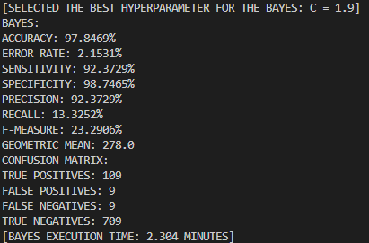
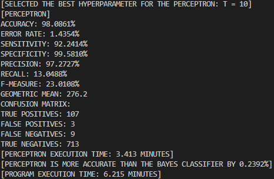
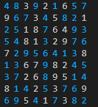
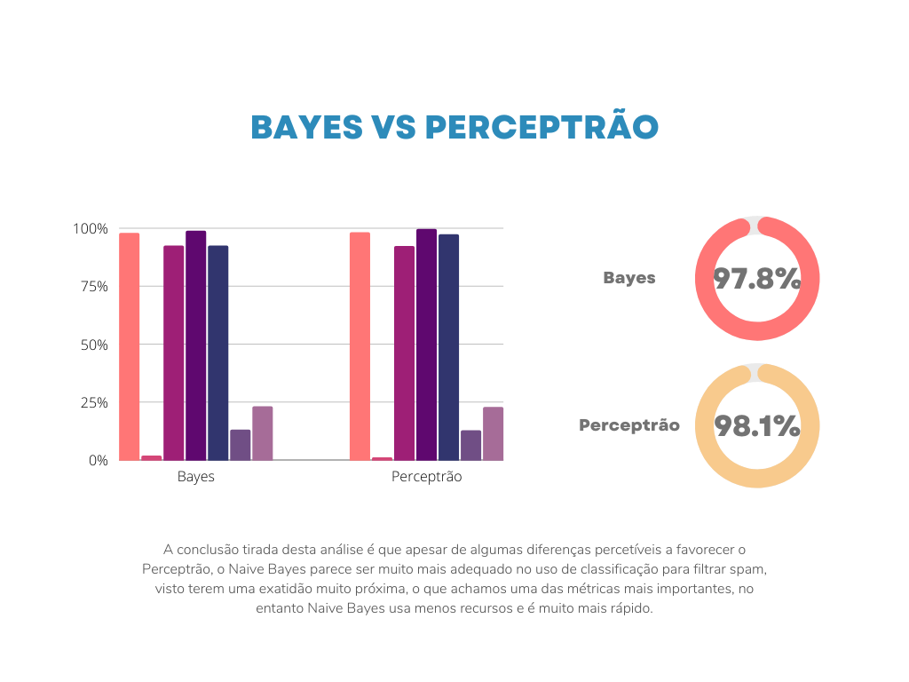
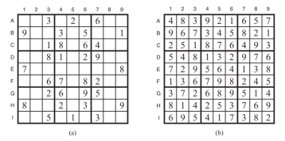

# *Relatório De Projecto*

## *Introdução Teórica*

### *Parte I: Naive Bayes & Perceptrão*

#### *Naive Bayes*

*O algoritmo Naive Bayes é um algoritmo de aprendizagem supervisionada, baseada no teorema de Bayes e é usado para problemas de classificação. ***O classificador Naive Bayes tem por base a probabilidade, o que significa que faz previsões da probabilidade de um objeto.*** É maioritariamente usado em classificação de texto que inclui um conjunto de treino de alta dimensão.*

*Podemos também afirmar que o classificador Naive Bayes é um dos algoritmos de classificação mais simples e eficaz que ajuda na construção de modelos de machine learning que pode fazer previsões rápidas.*

****O algoritmo de Naive Bayes está construído no princípio de que cada sample classificada não está relacionado a nenhuma outra sample.*** A presença ou ausência de uma característica não afeta a presença ou ausência da outra característica.*

*O Naive Bayes é constituído por Naive e Bayes, que podem ser descritos como:*

- ****Naive***: É chamado de Naive porque assume que a ocorrência de uma certa feature é independente da ocorrência de outras features. Por exemplo: se uma fruta é identificada com base na cor, forma, e sabor, então vermelho, esférico e sabor doce é reconhecido como uma maçã. Então vemos que cada feature individual contribui para identificar que é uma maçã sem dependerem de umas das outras.*
- ****Bayes***: É chamado de Bayes porque depende do principio do teorema de Bayes.*

*O teorema de Bayes também conhecido por Regra de Bayes ou Lei de Bayes, ***é usado para determinar a probabilidade de uma hipótese*** com conhecimento anterior. ***Depende da probabilidade condicional.****

*A fórmula do teorema de Bayes é dada por:*

$$ P(A|B)=\frac{P(B|A)P(A)}{P(B)} $$

*Assim, ***este teorema de Bayes é especialmente útil pois permite reverter a ordem na probabilidade condicional.****

```python
# TRAIN(): TRAINS THE MODEL; X REPRESENTS A VECTOR OF SAMPLES, Y REPRESENTS A VECTOR OF CORRESPONDING LABELS (1 FOR SPAM, 0 FOR HAM). EACH SAMPLE IS A DICIONARY WHERE THE KEY IS THE WORD AND THE VALUE IS THE ABSOLUTE FREQUENCY (COUNT) OF THE WORD IN THE SAMPLE.
def TRAIN(self, X, Y):
    # COMPUTE M, M_HAM, M_SPAM, N:
    M_SPAM = np.sum(Y == 1) # NUMBER OF SPAM SAMPLES: M_SPAM
    M_HAM = np.sum(Y == -1) # NUMBER OF HAM SAMPLES: M_HAM
    M = M_SPAM + M_HAM # TOTAL NUMBER OF SAMPLES: M
    N = len(X[0]) # NUMBER OF WORDS IN THE VOCABULARY: N
    # INITIALIZE THE B = LOG C + LOG M_HAM - LOG M_SPAM TO OFFSET THE REJECTION THRESHOLD.
    self.B = np.log(self.C) + np.log(M_HAM) - np.log(M_SPAM)
    # INITIALIZE THE PROBABILITIES, P IN R^{2 x N} WITH P_I_J = 1, W_SPAM = N, W_HAM = N:
    self.P = np.ones((2, N)) # PROBABILITIES, P IN R^{2 x N}
    W_SPAM = N # NUMBER OF WORDS IN THE SPAM VOCABULARY: W_SPAM
    W_HAM = N # NUMBER OF WORDS IN THE HAM VOCABULARY: W_HAM
    for I in range(M): # FOR EACH SAMPLE: X[I]
        if Y[I] == 1: # IF THE SAMPLE IS SPAM
            for J in range(N): # FOR EACH WORD IN THE VOCABULARY
                self.P[0, J] += X[I][J] # INCREMENT THE NUMBER OF TIMES THE WORD APPEARS IN THE SPAM VOCABULARY: P_SPAM_J; HERE X_I_J DENOTES THE NUMBER OF TIMES THE WORD J APPEARS IN THE SAMPLE X[I].
                W_SPAM += X[I][J] # INCREMENT THE NUMBER OF WORDS IN THE SPAM VOCABULARY: W_SPAM
        else: # IF THE SAMPLE IS HAM
            for J in range(N): # FOR EACH WORD IN THE VOCABULARY
                self.P[1, J] += X[I][J] # INCREMENT THE NUMBER OF TIMES THE WORD APPEARS IN THE HAM VOCABULARY: P_HAM_J; HERE X_I_J DENOTES THE NUMBER OF TIMES THE WORD J APPEARS IN THE SAMPLE X[I].
                W_HAM += X[I][J] # INCREMENT THE NUMBER OF WORDS IN THE HAM VOCABULARY: W_HAM
    # COMPUTE THE PROBABILITIES, P IN R^{2 x N}:
    self.P[0, :] /= W_SPAM # P_SPAM_J = P_SPAM_J / W_SPAM
    self.P[1, :] /= W_HAM # P_HAM_J = P_HAM_J / W_HAM

# CLASSIFY(): PREDICTS THE OUTPUT OF A SINGLE SAMPLE: X; SAMPLE IS A DICIONARY WHERE THE KEY IS THE WORD AND THE VALUE IS THE ABSOLUTE FREQUENCY (COUNT) OF THE WORD IN THE SAMPLE. RETURNS 1 IF SPAM, 0 IF HAM.
def CLASSIFY(self, X):
    T = -self.B # INITIALIZE THE SCORE THRESHOLD, T = -B.
    for J in range(len(X)): # FOR EACH WORD IN THE VOCABULARY
        T += X[J] * np.log(self.P[0, J] / self.P[1, J]) # INCREMENT THE SCORE THRESHOLD, T, BY THE LOG RATIO OF THE PROBABILITIES OF THE WORD J IN THE SPAM AND HAM VOCABULARIES.
    return 1 if T > 0 else -1 # IF THE SCORE THRESHOLD, T, IS GREATER THAN 0, THEN THE SAMPLE IS SPAM, OTHERWISE IT'S HAM.
```

##### *Vantagens e desvantagens do classificador de Naive Bayes*

###### *Vantagens*

- *Naive Bayes é um dos algoritmos de machine learning mais rápidos e fáceis para prever uma classe de datasets;*
- *Pode ser usado para classificações binárias e multi-class;*
- *Tem um bom desempenho nas previsões multi-class comparado a outros algoritmos;*
- *É a escolha mais popular nos problemas de classificação de texto.*
  
###### *Desvantagens*
- *Naive Bayes assume que todas as features são independentes ou não relacionadas, por isso não consegue aprender as relações entre features.*

*Os algoritmos Naive Bayes são usados principalmente em análise de sentimento, filtragem de spam, sistemas de recomendação, etc. ***Estes são rápidos e fáceis de implementar, mas sua maior desvantagem é que os classificadores precisam ser independentes.*** Na maioria dos casos da vida real, os classificadores são dependentes, o que prejudica o desempenho do classificador.*

#### *Perceptrão*

*O algoritmo do Perceptrão é um algoritmo de machine learning para classificação de duas classes. ***Ou seja, é um algoritmo de classificação binário.****

```python
# TRAIN(): TRAINS THE MODEL; X REPRESENTS A VECTOR OF SAMPLES, Y REPRESENTS A VECTOR OF CORRESPONDING LABELS. EACH SAMPLE IS A DICIONARY WHERE THE KEY IS THE WORD AND THE VALUE IS THE ABSOLUTE FREQUENCY (COUNT) OF THE WORD IN THE SAMPLE.
def TRAIN(self, X, Y):
    self.THETA = np.zeros(len(X[0])) # INITIALIZE THE WEIGHTS VECTOR WITH ZEROS.
    self.THETA_0 = 0 # INITIALIZE THE BIAS WITH ZERO.
    for _ in range(self.T): # FOR EACH ITERATION: T.
        for I in range(len(X)): # FOR EACH SAMPLE: X[I].
            if Y[I] * (np.dot(self.THETA, X[I]) + self.THETA_0) <= 0: # IF THE SAMPLE IS MISCLASSIFIED: UPDATE THE WEIGHTS AND THE BIAS.
                self.THETA += (Y[I] * np.array(X[I])) # UPDATE THE WEIGHTS: THETA: THETA = THETA + Y[I] * X[I].
                self.THETA_0 += Y[I] # UPDATE THE BIAS: THETA_0: THETA_0 = THETA_0 + Y[I].

# CLASSIFY(): PREDICTS THE OUTPUT OF A SINGLE SAMPLE: X; SAMPLE IS A DICIONARY WHERE THE KEY IS THE WORD AND THE VALUE IS THE ABSOLUTE FREQUENCY (COUNT) OF THE WORD IN THE SAMPLE. RETURNS 1 IF SPAM, 0 IF HAM.
def CLASSIFY(self, X):
    return np.sign(np.dot(self.THETA, X) + self.THETA_0) # CLASSIFY THE SAMPLE X USING THE WEIGHTS: THETA AND THE BIAS: THETA_0 STORED IN THE MODEL
```

****Viu-se o perceptrão como uma forma de encontrar um vetor de weights ω e um bias ϐ; este método faz um bom trabalho em separar samples de treino positivas de samples de treino negativas.*** No entanto, o perceptrão é tanto um modelo como um algoritmo. ***O objetivo do perceptrão é encontrar um hiperplano de separação para algum conjunto de dados de treino.****

*Cada conexão recebida tem um weight e o neurónio simplesmente soma todas as entradas ponderadas. Com base nesta soma, ele decide se "dispara" ou não. "Disparar" é interpretado como sendo um exemplo positivo e "não disparar" é interpretado como sendo um exemplo negativo. Em particular, se a soma ponderada for positiva, este "dispara" e, caso contrário, "não dispara".*

```python
# [...]
    if Y[I] * (np.dot(self.THETA, X[I]) + self.THETA_0) <= 0: # IF THE SAMPLE IS MISCLASSIFIED: UPDATE THE WEIGHTS AND THE BIAS.
        self.THETA += (Y[I] * np.array(X[I])) # UPDATE THE WEIGHTS: THETA: THETA = THETA + Y[I] * X[I].
        self.THETA_0 += Y[I] # UPDATE THE BIAS: THETA_0: THETA_0 = THETA_0 + Y[I].
```

*Matematicamente:*

$$ a = \sum_{}^{} (weights * input) $$

****O neurónio calcula a soma para determinar sua quantidade de "ativação".*** Se esta ativação for positiva (ou seja, a > 0), ela prevê que este exemplo é um exemplo positivo. Caso contrário, prevê um exemplo negativo. (Como representado acima.)*

*Os weights deste neurónio são bastante fáceis de interpretar. Suponha que uma feature recebe um weight zero. Então a "ativação" é a mesma independentemente do valor da feature. Portanto, as features com weight zero são ignorados. ***As características com weights positivos são indicativas de exemplos positivos porque fazem com que a "ativação" aumente. Features com weights negativos são indicativos de exemplos negativos pois causam a diminuição da "ativação".*** Geralmente é conveniente ter um limite diferente de zero. Em outras palavras, podemos querer prever positivo se a > 0 para algum valor θ. ***A maneira mais conveniente de conseguir isto é introduzir um termo de bias no neurónio, de modo que a "ativação" seja sempre aumentada por algum valor fixo ϐ.*** Assim, calculamos:*

$$ a = \sum_{}^{} (weights * input) + bias $$

##### *Error-Driven Updating*

*Como mencionado anteriormente, o perceptrão é um algoritmo clássico de machine learning, com duas principais características:*

- *Em primeiro lugar, é ***online***: Isto significa que, ***em vez de considerar todo o conjunto de dados ao mesmo tempo, analisa apenas uma sample, de cada vez***.*
  
  ```python
  # [...]
      for I in range(len(X)): # FOR EACH SAMPLE: X[I].
          if Y[I] * (np.dot(self.THETA, X[I]) + self.THETA_0) <= 0: # IF THE SAMPLE IS MISCLASSIFIED: UPDATE THE WEIGHTS AND THE BIAS.
              self.THETA += (Y[I] * np.array(X[I])) # UPDATE THE WEIGHTS: THETA: THETA = THETA + Y[I] * X[I].
              self.THETA_0 += Y[I] # UPDATE THE BIAS: THETA_0: THETA_0 = THETA_0 + Y[I].
  ```

- *Segundo, é ***guiado por erro*** (error-driven): Isto significa que, ***desde que esteja a "correr bem", não se preocupa em atualizar os seus parâmetros***. ***O algoritmo mantém um "palpite" em bons parâmetros*** (weights e bias) ***enquanto é executado.*** Este processa uma sample de cada vez. ***Para uma determinada sample, ele faz uma previsão, e verifica se essa previsão está correta*** (lembre-se de que são dados de treino, portanto, temos acesso a labels verdadeiras). ***Se a previsão estiver correta, não faz nada. Somente quando a previsão está incorreta, é que este altera os seus parâmetros de forma a se sair melhor nesta sample da próxima vez.*** Em seguida, segue para a próxima sample. Depois de atingir a última sample no conjunto de treino, este retorna para um número especificado de iterações.*
  
  ```python
  # [...]
      if Y[I] * (np.dot(self.THETA, X[I]) + self.THETA_0) <= 0: # IF THE SAMPLE IS MISCLASSIFIED: UPDATE THE WEIGHTS AND THE BIAS.
          self.THETA += (Y[I] * np.array(X[I])) # UPDATE THE WEIGHTS: THETA: THETA = THETA + Y[I] * X[I].
          self.THETA_0 += Y[I] # UPDATE THE BIAS: THETA_0: THETA_0 = THETA_0 + Y[I].
  ```

****O único hiperparâmetro do algoritmo do perceptrão é o T, o número de passagens a serem feitas sobre os dados de treino*** (número máximo de iterações). Se fizermos muitas passagens sobre os dados de treino, é provável que o algoritmo seja superajustado (overfitted). (Isto seria como estudar por muito tempo para um teste e apenas se confundir.) Por outro lado, rever os dados, apenas uma vez, pode levar a um underfitting.*

```python
# [...]
for _ in range(self.T): # FOR EACH ITERATION: T.
    for I in range(len(X)): # FOR EACH SAMPLE: X[I].
        if Y[I] * (np.dot(self.THETA, X[I]) + self.THETA_0) <= 0: # IF THE SAMPLE IS MISCLASSIFIED: UPDATE THE WEIGHTS AND THE BIAS.
            self.THETA += (Y[I] * np.array(X[I])) # UPDATE THE WEIGHTS: THETA: THETA = THETA + Y[I] * X[I].
            self.THETA_0 += Y[I] # UPDATE THE BIAS: THETA_0: THETA_0 = THETA_0 + Y[I].
```

##### *Interpretação Geométrica*

*A pergunta que você deveria estar a fazer agora é: ***qual é o limite de decisão do perceptrão?*** Pode-se responder a essa pergunta matematicamente. Para um perceptrão, ***o limite de decisão é exatamente onde o sinal da ativação, a, muda de -1 para +1.*** Noutras palavras, é o conjunto de pontos x que atingem ativação nula; ***Ou seja, os pontos que não são claramente positivos nem negativos.*** ***Para simplificar, primeiro consideramos o caso em que não há termo de "bias"*** (ou, de forma equivalente, o bias é zero). Formalmente, o limite de decisão B é:*

$$ B = \left\{ x: \sum_{d}^{} w_{d}x_{d}=0\right\} $$

*Dois vetores têm um dot product zero se e somente se eles são perpendiculares. ***Assim, se pensarmos nos weights como um vetor w, então o limite de decisão é simplesmente o plano perpendicular a w.****

*Assim, ***temos que a função de classificação do algoritmo do perceptrão, é nada mais que a deteção do sinal associado ao valor calculado entre o dot product dos weights com a sample mais o bias***. (Como representada abaixo.)*

```python
# CLASSIFY(): PREDICTS THE OUTPUT OF A SINGLE SAMPLE: X; SAMPLE IS A DICIONARY WHERE THE KEY IS THE WORD AND THE VALUE IS THE ABSOLUTE FREQUENCY (COUNT) OF THE WORD IN THE SAMPLE. RETURNS 1 IF SPAM, 0 IF HAM.
def CLASSIFY(self, X):
    return np.sign(np.dot(self.THETA, X) + self.THETA_0) # CLASSIFY THE SAMPLE X USING THE WEIGHTS: THETA AND THE BIAS: THETA_0 STORED IN THE MODEL
```

*Se o sinal for negativo é classificada a sample como negativa (ou seja, neste caso, ham); caso contrário com positiva (neste caso, como spam).*

### *Parte II: Sudoku*

*Problemas de Satisfação de Restrições (CSPs) ***são questões matemáticas definidas como um conjunto de objetos cujo estado deve satisfazer uma série de restrições ou limitações.*** Os CSPs representam as entidades num problema como uma coleção homogênea de restrições finitas sobre variáveis, que é resolvida por métodos de satisfação de restrições.*

*Algoritmos de procura para um CSP utilizam heurísticas gerais em vez de heurísticas específicas do problema. A ideia principal ***consiste em eliminar grandes partes do espaco de procura por identificação de combinações variâvel/valor que violam as restrições***.*

***Um CSP é resolvido quando cada variâvel tem um valor que satisfaz todas as restrições que lhe são impostas.***

*Primeiramente é necessário criar a definição do problema com base CSP, então criou-se uma classe CSP que irá servir para este propósito:*

```python
# CSP: DEFINES A REPRESENTATION OF A CONSTRAINT SATISFACTION PROBLEM. THE CSP IS DEFINED BY ITS VARIABLES, DOMAINS, NEIGHBORS, CONSTRAINTS.
class CSP:
    # INITIALIZE THE CSP OBJECT AND DEFINES THE NEIGHBORS OF EACH VARIABLE.
    def __init__(self, VARIABLES, DOMAINS, CONSTRAINTS):
        self.VARIABLES = VARIABLES # LIST OF VARIABLES
        self.DOMAINS = DOMAINS # DICTIONARY OF DOMAINS: THE KEYS OF THE DICTIONARY ARE THE VARIABLES. THE VALUE OF EACH KEY IN THE DICTIONARY IS THE LIST OF VALUES OF THAT VARIABLE. THE VALUES OF A VARIABLE ARE THE VALUES THAT THE VARIABLE CAN TAKE.
        self.CONSTRAINTS = CONSTRAINTS # LIST OF CONSTRAINTS: THE CONSTRAINT VARIABLE IS DEFINED BY A LISTS OF TWO TUPLES (PAIRS). EACH TUPLE REPRESENTS A PAIR OF VARIABLES THAT MUST SATISFY THE CONSTRAINT. THE CONSTRAINT IS SATISFIED IF THE PAIR DOES NOT HAVE THE SAME VALUE.
        self.NEIGHBORS = {} # DICTIONARY OF NEIGHBORS: THE KEY OF THE DICTIONARY IS THE VARIABLE. THE VALUE OF THE DICTIONARY IS THE LIST OF NEIGHBORS OF THE VARIABLE. THE NEIGHBORS OF A VARIABLE ARE THE VARIABLES THAT SHARE A CONSTRAINT WITH THE VARIABLE.
        for VARIABLE in self.VARIABLES: # FOR EACH VARIABLE, FIND THE NEIGHBORS OF THE VARIABLE.
            self.NEIGHBORS[VARIABLE] = [] # INITIALIZE THE LIST OF NEIGHBORS OF THE VARIABLE.
            for CONSTRAINT in self.CONSTRAINTS: # FOR EACH CONSTRAINT, FIND THE NEIGHBORS OF THE VARIABLE.
                if VARIABLE in CONSTRAINT: # IF THE VARIABLE IS INVOLVED IN THE CONSTRAINT, FIND THE NEIGHBORS OF THE VARIABLE.
                    for VARIABLE_2 in CONSTRAINT: # FOR EACH VARIABLE INVOLVED IN THE CONSTRAINT, FIND THE NEIGHBORS OF THE VARIABLE.
                        if VARIABLE_2 != VARIABLE: # IF THE THEY ARE NOT THE SAME VARIABLE, ADD THE VARIABLE TO THE LIST OF NEIGHBORS OF THE VARIABLE.
                            self.NEIGHBORS[VARIABLE].append(VARIABLE_2) # ADD THE VARIABLE TO THE LIST OF NEIGHBORS OF THE VARIABLE.
```

*Como se vê acima, um CSP, é composto por três componentes: ***X***, ***D***, ***C*** onde:*

- ****X*** é uma ***lista de variáveis***.* *Neste caso, representa uma lista de variáveis, ou seja, corresponde à componente X. ***As variáveis correspondem às células do problema de Sudoku, sendo que cada célula é representada por uma tupla (linha, coluna).*** (Abaixo está representada a inicialização usada no projecto.)*
  
  ```python
  # DEFINE THE VARIABLES OF THE PROBLEM. VARIABLES ARE THE CELLS OF THE SUDOKU PROBLEM. EACH CELL IS REPRESENTED BY A TUPLE (ROW, COLUMN). THE ROW AND THE COLUMN ARE NUMBERS BETWEEN 1 AND 9, INCLUSIVE.
  VARIABLES = [(ROW, COLUMN) for ROW in range(1, 10) for COLUMN in range(1, 10)]
  ```

- ****D*** é um ***dicionário de domínios***, um para cada variável. ***Um domínio de uma variável é o conjunto de valores permitidos que essa variável pode tomar.**** *Neste caso, representa um dicionário de domínios, ou seja, corresponde à componente D. ***Os domínios são os valores possíveis para cada célula (variável).*** (Abaixo está representada a inicialização usada no projecto.)*
  
  ```python
  # DEFINE THE DOMAINS OF THE PROBLEM. DOMAINS ARE THE POSSIBLE VALUES OF EACH CELL. EMPTY CELLS CAN HAVE A VALUE BETWEEN 1 AND 9, INCLUSIVE. FILLED CELLS CAN ONLY HAVE THE VALUE FILLED IN THE CELL.
  DOMAINS = {} # DOMAINS IS A DICTIONARY. THE KEY OF THE DICTIONARY IS THE VARIABLE. THE VALUE OF THE DICTIONARY IS THE LIST OF POSSIBLE VALUES OF THE VARIABLE.
  for ROW in range(1, 10): # FOR EACH ROW:
      for COLUMN in range(1, 10): # FOR EACH COLUMN:
          if SUDOKU[ROW - 1][COLUMN - 1] == 0: # IF THE CELL IS EMPTY.
              DOMAINS[(ROW, COLUMN)] = [VALUE for VALUE in range(1, 10)] # THE CELL CAN HAVE A VALUE BETWEEN 1 AND 9, INCLUSIVE.
          else: # IF THE CELL IS FILLED.
              DOMAINS[(ROW, COLUMN)] = [SUDOKU[ROW - 1][COLUMN - 1]] # THE CELL CAN ONLY HAVE THE VALUE FILLED IN THE CELL.
  ```

- ****C*** é uma ***lista de restrições que especifíca combinações permitidas de valores***. Ou seja, é uma lista de tuplos, cada tuplo sendo um par de duas variáveis que deve satisfazer a condição; ***tal condição é satisfeita se o par não tiver o mesmo valor***.* *Neste caso, representa uma lista de restrições, ou seja, corresponde à componente C. Esta variável Python é definida por uma lista de duas tuplas (pares), ***onde cada tupla representa um par de células que terão de satisfazer a restrição (neste caso o par de células não devem ter o mesmo valor).*** (Abaixo está representada a inicialização usada no projecto.)*
  
  ```python
  # DEFINE THE CONSTRAINTS OF THE PROBLEM. THE CONSTRAINT VARIABLE IS DEFINED BY A LISTS OF TWO TUPLES (PAIRS). EACH TUPLE REPRESENTS A PAIR OF CELLS THAT MUST SATISFY THE CONSTRAINT. THE CONSTRAINT IS SATISFIED IF THE PAIR OF CELLS DOES NOT HAVE THE SAME VALUE. THE CONSTRAINTS ARE: 1. EACH ROW OF THE SUDOKU PROBLEM MUST CONTAIN ALL THE NUMBERS BETWEEN 1 AND 9, INCLUSIVE, WITHOUT REPETITIONS. 2. EACH COLUMN OF THE SUDOKU PROBLEM MUST CONTAIN ALL THE NUMBERS BETWEEN 1 AND 9, INCLUSIVE, WITHOUT REPETITIONS. 3. EACH 3x3 SUB-GRID OF THE SUDOKU PROBLEM MUST CONTAIN ALL THE NUMBERS BETWEEN 1 AND 9, INCLUSIVE, WITHOUT REPETITIONS.
  CONSTRAINTS = []
  # CONSTRAINT 1: EACH ROW OF THE SUDOKU PROBLEM MUST CONTAIN ALL THE NUMBERS BETWEEN 1 AND 9, INCLUSIVE, WITHOUT REPETITIONS. INCLUDE ALL PERMUATIONS OF EACH PAIR OF CELLS OF THE ROW THAT MUST SATISFY THE CONSTRAINT, WITH REPETITIONS.
  for ROW in range(1, 10): # FOR EACH ROW OF THE SUDOKU PROBLEM:
      for COLUMN_1 in range(1, 10): # FOR EACH COLUMN OF THE SUDOKU PROBLEM:
          for COLUMN_2 in range(COLUMN_1 + 1, 10): # FOR EACH COLUMN + 1 OF THE SUDOKU PROBLEM:
              CONSTRAINTS.append([(ROW, COLUMN_1), (ROW, COLUMN_2)]) # INCLUDE THE PAIR OF CELLS THAT MUST SATISFY THE CONSTRAINT.
  # CONSTRAINT 2: EACH COLUMN OF THE SUDOKU PROBLEM MUST CONTAIN ALL THE NUMBERS BETWEEN 1 AND 9, INCLUSIVE. INCLUDE ALL PERMUATIONS OF EACH PAIR OF CELLS OF THE COLUMN THAT MUST SATISFY THE CONSTRAINT, WITH REPETITIONS.
  for COLUMN in range(1, 10): # FOR EACH COLUMN OF THE SUDOKU PROBLEM:
      for ROW_1 in range(1, 10): # FOR EACH ROW OF THE SUDOKU PROBLEM:
          for ROW_2 in range(ROW_1 + 1, 10): # FOR EACH ROW + 1 OF THE SUDOKU PROBLEM:
              CONSTRAINTS.append([(ROW_1, COLUMN), (ROW_2, COLUMN)]) # INCLUDE THE PAIR OF CELLS THAT MUST SATISFY THE CONSTRAINT.
  # CONSTRAINT 3: EACH 3x3 SUB-GRID OF THE SUDOKU PROBLEM MUST CONTAIN ALL THE NUMBERS BETWEEN 1 AND 9, INCLUSIVE. INCLUDE ALL PERMUATIONS OF EACH PAIR OF CELLS OF THE SUB-GRID THAT MUST SATISFY THE CONSTRAINT, WITH REPETITIONS.
  for ROW in range(1, 10, 3): # FOR EACH ROW OF THE SUDOKU PROBLEM:
      for COLUMN in range(1, 10, 3): # FOR EACH COLUMN OF THE SUDOKU PROBLEM:
          for ROW_1 in range(ROW, ROW + 3): # FOR EACH ROW OF THE SUB-GRID:
              for COLUMN_1 in range(COLUMN, COLUMN + 3): # FOR EACH COLUMN OF THE SUB-GRID:
                  for ROW_2 in range(ROW_1, ROW + 3): # FOR EACH ROW + 1 OF THE SUB-GRID:
                      for COLUMN_2 in range(COLUMN_1 + 1, COLUMN + 3): # FOR EACH COLUMN + 1 OF THE SUB-GRID:
                          CONSTRAINTS.append([(ROW_1, COLUMN_1), (ROW_2, COLUMN_2)]) # INCLUDE THE PAIR OF CELLS THAT MUST SATISFY THE CONSTRAINT.
  ```

*Existe também uma inicialização de uma variável ***neighbours***, que representa um dicionário de vizinhos em relação à variável. Estes vizinhos da variável são variáveis que partilham a mesma restrição com a variável.*

***Uma solução é uma atribuição de valores consistente e completa.***

- ****Consistente*** ou legal: é uma atribuição de valores que não viola quaisquer restrições.*
- ****Completa***: é uma atribuição de valores a todas as variáveis.*

#### *Consistência de arcos (arc consistent)*

*Uma ***variável*** diz-se ***arc consistent se todos os valores do seu domínio satisfazem as restrições binárias***.*

- *Ou seja, a variável ϰi diz-se arc consistent em relação a outra variável ϰj se todos os valores do seu domínio Ⅾi existe algum valor do domínio Ⅾj que satisfaz a restrição binária do arco (ϰi, ϰj).*

*Uma ***rede*** diz-se ***arc consistent se todas as variáveis são arc consistent em relação a todas as outras variáveis*** (com quem tenham uma restrição binária).*

##### *AC3: Arc Consistency Algorithm #3*

*O algoritmo mais popular para implementar arc consistency num CSP é denominado de AC-3:*

```python
# AC3(): RUNS THE AC-3 ALGORITHM. RETURNS FALSE IF AN INCONSISTENCY IS FOUND, OTHERWISE RETURNS TRUE.
def AC3(CSP):
    QUEUE = [] # QUEUE, QUEUE OF ARCS, INITIALLY ALL THE ARCS IN THE PROBLEM.
    for VARIABLE in CSP.VARIABLES: # FOR EACH VARIABLE, FIND THE NEIGHBORS OF THE VARIABLE.
        for NEIGHBOR in CSP.NEIGHBORS[VARIABLE]: # FOR EACH NEIGHBOR OF THE VARIABLE, ADD THE ARC (VARIABLE, NEIGHBOR) TO THE QUEUE.
            QUEUE.append((VARIABLE, NEIGHBOR)) # ADD THE ARC (VARIABLE, NEIGHBOR) TO THE QUEUE.
    while len(QUEUE) > 0: # WHILE THE QUEUE IS NOT EMPTY, POP THE FIRST ARC (X_I, X_J) FROM THE QUEUE.
        (X_I, X_J) = QUEUE.pop(0) # POP THE FIRST ARC (X_I, X_J) FROM THE QUEUE.
        if REVISE(CSP, X_I, X_J): # IF THE DOMAINS OF THE VARIABLE X_I ARE REVISED, DO THE FOLLOWING:
            if len(CSP.DOMAINS[X_I]) == 0: # IF THE DOMAIN OF THE VARIABLE X_I IS EMPTY, RETURN FALSE.
                return False # RETURN FALSE.
            for X_K in CSP.NEIGHBORS[X_I]: # FOR EACH X_K IN NEIGHBOURS MINUS X_J, ADD THE (X_K, X_I) TO THE QUEUE.
                if X_K != X_J: # IF X_K IS DIFERENT THAN X_J, ADD THE (X_K, X_I) TO THE QUEUE.
                    QUEUE.append((X_K, X_I)) # ADD THE (X_K, X_I) TO THE QUEUE.
    return True # RETURNS TRUE.

# REVISE(): REVISES THE DOMAINS OF THE VARIABLE X_I, GIVEN THE DOMAINS OF THE VARIABLE X_J. RETURNS TRUE IF THE DOMAINS OF THE VARIABLE X_I ARE REVISED, OTHERWISE RETURNS FALSE.
def REVISE(CSP, X_I, X_J):
    REVISED = False # REVISED, BOOLEAN, INDICATES IF THE DOMAINS OF THE VARIABLE X_I ARE REVISED.
    for X in CSP.DOMAINS[X_I]: # FOR EACH VALUE X OF THE DOMAIN OF THE VARIABLE X_I, CHECK IF THE VALUE X SATISFIES THE CONSTRAINT (X_I, X_J).
        SATISFIED = False # SATISFIED, BOOLEAN, INDICATES IF THE VALUE X SATISFIES THE CONSTRAINT (X_I, X_J).
        for Y in CSP.DOMAINS[X_J]: # FOR EACH VALUE Y OF THE DOMAIN OF THE VARIABLE X_J, CHECK IF THE VALUE X SATISFIES THE CONSTRAINT (X_I, X_J).
            if X != Y: # IF THE VALUE X DOES NOT SATISFY THE CONSTRAINT (X_I, X_J), REMOVE THE VALUE X FROM THE DOMAIN OF THE VARIABLE X_I.
                SATISFIED = True # THE VALUE X SATISFIES THE CONSTRAINT (X_I, X_J).
                break # BREAK THE LOOP.
        if not SATISFIED: # IF THERE'S NO VALUE Y OF THE DOMAIN OF THE VARIABLE X_J THAT ALLOWS (X, Y) TO SATISFY THE CONSTRAINT BETWEEN (X_I, X_J), REMOVE THE VALUE X FROM THE DOMAIN OF THE VARIABLE X_I.
            del CSP.DOMAINS[X_I][CSP.DOMAINS[X_I].index(X)] # REMOVE THE VALUE X FROM THE DOMAIN OF THE VARIABLE X_I.
            REVISED = True # THE DOMAINS OF THE VARIABLE X_I ARE REVISED.
    return REVISED # RETURN THE BOOLEAN REVISED.
```

- *Para tornar consistentes todos os arcos do grafo de restrições é mantida uma lista de arcos a tratar; esta lista contém, inicialmente, todos os arcos do grafo de restrições.*
  
  ```python
  # [...]
  QUEUE = [] # QUEUE, QUEUE OF ARCS, INITIALLY ALL THE ARCS IN THE PROBLEM.
  for VARIABLE in CSP.VARIABLES: # FOR EACH VARIABLE, FIND THE NEIGHBORS OF THE VARIABLE.
      for NEIGHBOR in CSP.NEIGHBORS[VARIABLE]: # FOR EACH NEIGHBOR OF THE VARIABLE, ADD THE ARC (VARIABLE, NEIGHBOR) TO THE QUEUE.
          QUEUE.append((VARIABLE, NEIGHBOR)) # ADD THE ARC (VARIABLE, NEIGHBOR) TO THE QUEUE.
  # [...]
  ```

- *Um arco (ϰi, ϰj) da lista (aleatoriamente escolhido) é retirado; ϰi é, então, tornado arc consistent com ϰj.*
  
  ```python
  # [...]
  while len(QUEUE) > 0: # WHILE THE QUEUE IS NOT EMPTY, POP THE FIRST ARC (X_I, X_J) FROM THE QUEUE.
      (X_I, X_J) = QUEUE.pop(0) # POP THE FIRST ARC (X_I, X_J) FROM THE QUEUE.
      if REVISE(CSP, X_I, X_J): # IF THE DOMAINS OF THE VARIABLE X_I ARE REVISED, DO THE FOLLOWING:
  # [...]
  ```
  
  - *Se no passo anterior Ⅾi (domínio de ϰi) ficou inalterado, o algoritmo volta-se para outro arco da lista.*
  
  - *Se Ⅾi mudou, ou seja, ficou mais pequeno, então todos os arcos (ϰk, ϰi) (sendo ϰk as variáveis vizinhas (***neighbours***) de ϰi com k ≠ j) são adicionados à lista, pois a redução de Ⅾi pode significar uma revisão (redução) nos domínios Ⅾk (ainda que ϰk já tenha sido previamente considerada).*
    
    ```python
    # [...]
    for X_K in CSP.NEIGHBORS[X_I]: # FOR EACH X_K IN NEIGHBOURS MINUS X_J, ADD THE (X_K, X_I) TO THE QUEUE.
        if X_K != X_J: # IF X_K IS DIFERENT THAN X_J, ADD THE (X_K, X_I) TO THE QUEUE.
            QUEUE.append((X_K, X_I)) # ADD THE (X_K, X_I) TO THE QUEUE.
    # [...]
    ```

- *Caso algum Ⅾi seja reduzido de tal modo que se torne vazio então AC-3 retorna falha. Tal significa que o CSP não tem solução (com o tipo de consistência e algoritmo em uso). ***Ou seja, não é consistente.****
  
  ```python
  # [...]
  if len(CSP.DOMAINS[X_I]) == 0: # IF THE DOMAIN OF THE VARIABLE X_I IS EMPTY, RETURN FALSE.
      return False # RETURN FALSE.
  # [...]
  ```
  
  - *Caso contrário o algoritmo continua, revendo os valores dos domínios das variáveis até que a lista de arcos esteja vazia.*
    
    ```python
    # [...]
    while len(QUEUE) > 0: # WHILE THE QUEUE IS NOT EMPTY, POP THE FIRST ARC (X_I, X_J) FROM THE QUEUE.
        # [...]
    # [...]
    ```

*No final do algoritmo ficamos com um CSP que é equivalente ao original pois tem as mesmas soluções. Tendo os domínios das variáveis sido diminuídos, num CSP que é arc consistent a pesquisa será mais rápida.*

## *Resultados Obtidos*

### *Definição das métricas*

*Neste trabalho são consideradas as seguintes métricas:*

- ****Accuracy***: Mede o rácio das previsões corretas sobre o número total de instâncias avaliadas;*

$$ \frac{True Positives + True Negatives}{True Positives + False Positives + True Negatives + False Negatives} $$

- ****Error Rate***: Mede o rácio das previsões incorretas sobre o número total de instâncias avaliadas;*

$$ \frac{False Positives + False Negatives}{True Positives + False Positives + True Negatives + False Negatives} $$

- ****Sensitivity***: Mede a fração de padrões positivos que são classificados corretamente;*

$$ \frac{True Positives}{True Positives + False Negatives} $$

- ****Specificity***: Mede a fração de padrões negativos que são classificados corretamente;*

$$ \frac{True Negatives}{True Negatives + False Positive} $$

- ****Precision***: Mede os padrões positivos que são classificados corretamente a partir do número total de padrões numa classe positiva;*

$$ \frac{True Positives}{True Positives + False Positives} $$

- ****Recall***: Mede a fração dos padrões positivos que são corretamente classificados;*

$$ \frac{True Positives}{True Positives + True Negatives} $$

- ****F-measure***: Representa a média harmónica entre os valores Recall e Precision;*

$$ \frac{2*Precision*Recall}{Precision+Recall} $$

- ****Geometric Mean***: Métrica usada para maximizar o rácio positivo verdadeiro e o rácio negativo verdadeiro, e simultaneamente mante-los relativamente equilibrados.*

$$ \sqrt{True Positives * True Negatives} $$

### *Algoritmo De Naive Bayes*

*Correndo o algoritmo Naive Bayes em Python obtemos as seguintes métricas:*

<p align="center">
    
</p>

*Para esta solução vemos que foi utilizado o hiperparâmetro C = 1.9, este será o valor que dá a melhor exatidão ao algoritmo.*

*Neste caso, observamos pela Confusion Matrix que temos 109 samples corretamente previstas como SPAM e 709 samples corretamente previstas como HAM. Os restantes valores são considerados falsos positivos e falsos negativos.*

*Sendo assim temos uma exatidão de aproximadamente 98%, o que dá um erro de 2%.*

*Podemos também concluir que este algoritmo teve uma capacidade de:*

- *Prever true positives com uma taxa de aproximadamente 92% (Sensivity);*
- *Prever true negatives com uma taxa de aproximadamente 99% (Specificity);*
- *Identificar corretamente as Positive samples com uma taxa de aproximadamente 92% (Precision);*
- *Detetar positive samples com uma taxa de aproximadamente 13% (Recall);*
- *Obter uma média harmónica com uma taxa de aproximadamente 23% (F-measure);*
- *Obter uma média de tendência de valor 278.*

*Observamos também que o algoritmo Bayes teve um tempo de execução de 2.3 segundos, o que pode ser considerado rápido.*

### *Algoritmo Do Perceptrão*

*Correndo o algoritmo Perceptrão em Python obtemos as seguintes métricas:*

<p align="center">
    
</p>

*Para esta solução vemos que foi utilizado o hiperparâmetro T = 10, este será o valor que dá a melhor exatidão ao algoritmo.*

*No Perceptrão, observamos pela Confusion Matrix que temos 107 samples corretamente previstas como SPAM e 713 corretamente previstas como HAM. Os restantes valores são considerados falsos positivos (3 samples) e falsos negativos (9 samples).*

*Sendo assim temos uma exatidão de aproximadamente 98%, o que dá aproximadamente um erro de 1.4%.*

*Podemos também concluir que este algoritmo teve uma capacidade de:*

- *Prever true positives com uma taxa de aproximadamente 92% (Sensivity);*
- *Prever true negatives com uma taxa muito perto de 100% (Specificity);*
- *Identificar corretamente as positive samples com uma taxa de aproximadamente 97% (Precision);*
- *Detetar positive samples com uma taxa de aproximadamente 13% (Recall);*
- *Obter uma média harmónica com uma taxa de aproximadamente 23% (F-measure);*
- *Obter uma média de tendência de valor 276.2.*

*Observamos também que o algoritmo Perceptrão teve um tempo de execução de 6.215 segundos, o que é algo lento.*

### *Algoritmo AC-3*

*Correndo o algoritmo AC-3 para a resolução do Sudoku em Python obtemos:*

<p align="center">
    
</p>

*Os valores a branco representam a tabela inicial e os valores a azul representam os valores adicionados pelo algoritmo.*

*A solução dada pelo algoritmo AC-3 é satisfatória e não viola restrições. Podemos ver que o problema de Sudoku foi resolvido.*

*Neste caso não obtemos métricas, pelo que o programa é bastante simples e não são necessárias.*

## *Análise dos resultados obtidos*

### *Naive Bayes & Perceptrão*

*Tomando como correto os valores das métricas, consegue-se tirar algumas conclusões comparando o algoritmo Naive Bayes e Perceptrão.*

*Ambos algoritmos tiveram uma exatidão muito próxima, pelo que não podemos tirar conclusões muito antecipadas só por essa métrica, apesar de o Perceptrão ter algumas casas decimais acima do Naive Bayes.*

*No que toca a Sensitivity também ambos tiveram muito próximos um do outro, o que significa que têm ambos uma capacidade de prever true positives de aproximadamente 92%. Novamente conseguimos verificar uma pequena diferença nas casas decimais, neste caso a favorecer o Naive Bayes.*

*Passando agora a Specificity, existe agora uma diferença maior, favorecendo visivelmente o Perceptrão. Isto significa que, como está criado, o Perceptrão é melhor a prever true negatives, tendo uma taxa muito próxima de 100%.*

*Podemos também ver uma diferença bastante grande na Precision, novamente a favorecer o Perceptrão, significando que o Perceptrão é superior a identificar corretamente as positive samples.*

*Nas duas seguintes métricas, sendo elas Recall e F-measure, novamente são ambos muito idênticos, com apenas umas casas decimais a separá-los. É de notar que, ambas as métricas favorecem o Naive Bayes por muito pouco. Podemos, então, concluir que o Naive Bayes é ligeiramente melhor a detetar positive samples e a obter uma média harmónica.*

*Finalmente chegamos ao tempo de execução. A diferença de tempos de execução é bastante notável, tendo que o Naive Bayes é sensivelmente 4 segundos mais rápido neste caso. Na verdade, pode não parecer muito, mas em datasets muito maiores esta diferença irá aumentar ainda mais. Podemos concluir que o Naive Bayes é bastante mais rápido, talvez por o uso de menos recursos.*

<p align="center">
    
</p>

*A conclusão tirada desta análise é que apesar de algumas diferenças percetíveis a favorecer o Perceptrão, o Naive Bayes parece ser muito mais adequado no uso de classificação para filtrar spam, visto terem uma exatidão muito próxima, o que achamos uma das métricas mais importantes, no entanto Naive Bayes usa menos recursos e é muito mais rápido.*

### *AC-3*

*Analisando mais a fundo o resultado obtido no algoritmo AC-3, notamos que a solução dada pelo algoritmo é uma solução ao problema. Ainda mais, podemos ver pela seguinte imagem que chegou ao resultado pretendido pelo enunciado do trabalho:*

<p align="center">
    
</p>

*O resultado obtido foi praticamente instantâneo pelo que não temos nada a referir sobre a eficiência do algoritmo em termos de tempo.*

*Podemos então concluir que o algoritmo AC-3 é mais do que adequado para problemas desta natureza, no entanto a solução nunca é garantida.*

*O grande problema no uso deste algoritmo é que é necessária a bem definição do problema antes de o aplicar, pelo que uma má definição do problema resulta num erro e impossibilidade de obter uma solução viável.*

## *Conclusão*

*O objetivo deste trabalho prático foi elaborar e aplicar três algoritmos em Python ou Julia, sendo eles o Naive Bayes e Perceptron, ambos com o objetivo de criar filtro de spam com machine learning, e um algoritmo AC-3 para resolver um problema de Sudoku.*

*Para o objetivo de criar filtro de spam foi imposta a necessidade de utilizar um dataset específico, a necessidade de utilizar um modelo de bag of words para o Perceptron e apresentar métricas de performance para uma posterior análise de ambos os algoritmos.*

*Para o objetivo de resolver o problema de Sudoku foi apenas imposta a necessidade de utilizar inferência de restrições de consistência de arco.*

*Sumarizando, este trabalho conseguiu atingir ambos objetivos usando Python, realçando as diferenças entre os algoritmos e referindo qual seria, na nossa opinião, o algoritmo ótimo para solucionar o problema de filtro de spam. No caso do algoritmo AC-3, não houve qualquer outra comparação, no entanto pode-se verificar que, seja como for, é bastante adequado.*

*Podemos também referir que, apesar de se ter chegado a soluções adequadas, haveria sempre a possibilidade de otimização dos algoritmos descritos neste trabalho, no entanto, a execução do trabalho tomou apenas como base os códigos providenciados pelo docente da unidade curricular.*

## *Bibliografia*
 - *Ficheiro P5 eLearning – Algoritmo Naive Bayes, prof. Gonçalo Valadão*
 - *Ficheiro P8 eLearning – Algoritmo Perceptrão, prof. Gonçalo Valadão*
 - *Ficheiro P14 eLearning – CSP e AC-3, prof. Gonçalo Valadão*
 - *A Course in Machine Learning - Hal Daumé III*
 - *https://deepai.org/machine-learning-glossary-and-terms/f-score*
 - *https://machinelearningmastery.com/precision-recall-and-f-measure-for-imbalanced-classification/*
 - *https://www.javatpoint.com/precision-and-recall-in-machine-learning*
 - *https://dataaspirant.com/naive-bayes-classifier-machine-learning/*
