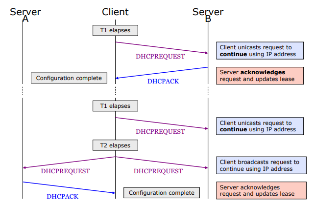
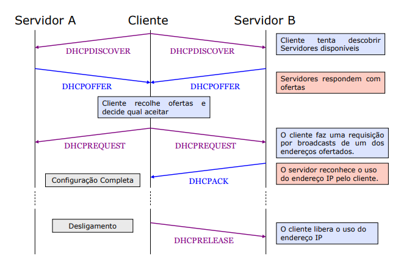

# *DHCP: Dynamic Host Configuration Protocol*
*DHCP ***é o mecanismo para alocação dinánica de endereços IP.****
 - ****Criado para facilitar a configuração e administração do protocolo TCP/IP*** numa rede com um grande número de máquinas.*
    - *Evita problemas de conectividade ou desorganização da rede, tais como: mudança de endereços IP, gateway e conflito de endereços.*
    - *Simplifica a gestão de informações sobre parâmetros de configuração do cliente como o gateway padrão, nome do domínio, servidor DNS, entre outros.*

 - ****Servidor DHCP***: é um servidor Linux, Windows ou qualquer outro sistema operacional onde é instalado e configuradoo o serviço DHCP.*
 - ****Cliente DHCP***: é qualquer dispositivo de rede capaz de obter as configurações de TCP/IP a partir de um servidor DHCP.*

> ****DHCP*** (Dynamic Host Configuration Protocol) ***is a protocol that provides quick, automatic, and central management for the distribution of IP addresses within a network.*** It's also used to configure the subnet mask, default gateway, and DNS server information on the device.*

## *Modos de atribuição de endereços*
 - ***Dinâmico***:
   - *Endereço a atribuir é escolhido de uma gama designada para o efeito (pool).*
      > ****Pool de endereços***: após definir um escopo DHCP e aplicar intervalos de exclusão, os endereços remanescentes formam a pool de endereços disponíveis dentro do escopo.*
      > - ****Escopo***: intervalo consecutivo completo dos endereços IP possíveis para uma rede.*
      > - ****Intervalo de exclusão***: um intervalo de exclusão é uma sequência limitada de endereços IP dentro de um escopo, excluíndo os endereços que são fornecidos pelo DHCP. Os intervalos de exclusão asseguram que quaisquer endereços nesses intervalos não são oferecidos pelo servidor aos clientes DHCP na sua rede.* 
   - *Atribuição por um período de tempo limitado — aluguer (lease).*
      > ****Tempo de renovação e concessão: Concessão:*** Período de tempo especificado por um servidor DHCP durante o qual um computador cliente pode utilizar um endereço IP.*
      - *Quando for libertado (explicitamente ou por não renovação), fica disponível para atribuir a outras máquinas.*
 - ***Automático***:
    - *Quando a máquina se liga pela primeiro vez é atribuído um endereço da pool.*
    - *O endereço fica permanentemente associado à máquina cliente (lease infinita).*
      > ****Tempo de renovação e concessão: Reserva:*** Concessão de um endereço permanente pelo servidor DHCP; certificando-se que o dispositivo de hardware especificado na sub-rede pode sempre utilizar o mesmo endereço IP.*
    - *O servidor guarda a associação do endereço atribuído ao identificador (ou MAC address) do cliente.*
    - *Sempre que o cliente pedir um endereço, é lhe atribuído o mesmo.*
 - ****Manual***: O administrador configura manualmente a associação entre o identificador do cliente (ou o MAC address) e o endereço IP a atribuir.*

### *Processo de renovação de uma concessão*
 - ****O cliente envia uma mensagem DHCPRequest diretamente ao servidor*** que anteriormente havia efetuado a concessão (pois agora o cliente tem um endereço IP e sabe o endereço IP do servidor DHCP), para renovar e estender a concessão de endereço atual.*
   - ****Se o servidor DHCP original estiver ativo, ele envia uma mensagem DHCPACK***, o que significa que a concessão atual foi renovada.*
   - ****Se o cliente não conseguir se comunicar com o servidor DHCP original, o cliente tenta renovar a concessão atual*** com qualquer servidor DHCP disponível, ***enviando um DHCPDISCOVER em broadcast***.*
 - ****Se um servidor responder com um DHCPOFFER para atualizar a concessão atual***, o cliente poderá renovar a concessão baseada na oferta do servidor DHCP, e continuar operando normalmente na rede.*

****Se a concessão expirar e nenhum servidor foi contactado, o cliente deve interromper imediatamente o uso do endereço IP concedido.*** Em seguida, o cliente repete todo o processo de obtenção de uma nova concessão.*

## *Como é que o DHCP funciona?*
> ****A DHCP server issues unique IP addresses and automatically configures other network information.*** In most homes and small businesses, the router acts as the DHCP server. In large networks, a single computer might take on that role.*
> 
> *To make this work, ***a device (the client) requests an IP address*** from a router (the host). Then, ***the host assigns an available IP address*** so that the client can communicate on the network.*

*1. Na primeira fase o cliente envia DISCOVER, ou seja, solicita um endereço (broadcast).*

> *When a device is turned on and connected to a network that has a DHCP server, it sends a ***request to the server, called a DHCPDISCOVER request***.*

*2. De seguida os servidores enviam uma resposta OFFER, ou seja, oferecem um endereço.*

> *After the DISCOVER packet reaches the DHCP server, ***the server holds on to an IP address that the device can use***, then ***offers the client the address with a DHCPOFFER packet***.*

*3. Após a oferta o cliente envia uma resposta REQUEST, ou seja, o cliente faz um pedido po broadcasts de um dos endereços oferecidos pelos servidores.*

> ****Once the offer has been made for the chosen IP address, the device responds to the DHCP server with a DHCPREQUEST packet to accept it***. Then, the server ***sends an ACK to confirm that the device has that specific IP address*** and to define the amount of time that the device can use the address before getting a new one.*

*4. Os servidores enviam uma resposta ACKNOWLEDGE ou não (ACK/NAK).*

> ***If the server decides that the device cannot have the IP address, it will send a NACK.***

### *Tipos de mensagens*
 - ****DISCOVER***: Cliente via broadcast descobre um servidor disponível.*
 - ****OFFER***: Servidor responde ao cliente oferecendo parâmetros de configuração.*
 - ****REQUEST***: Cliente faz um pedido por broadcasts de um dos endereços oferecidos.*
 - ****ACK***: Servidor responde ao cliente confirmando o pedido.*
 - ****NAK***: Servidor responde ao cliente negando o pedido.*
 - ****RELEASE***: Cliente responde ao servidor que o endereço IP está libertado.*
 - ****DECLINE***: Cliente notifica o servidor que o endereço IP está em uso.*

> ## *Pros and Cons of Using DHCP*
> *A computer, or any device that connects to a network (local or internet), must be properly configured to communicate on that network. Since DHCP allows that configuration to happen automatically, it's used in almost every device that connects to a network including computers, switches, smartphones, and gaming consoles.*
> 
> *Because of this dynamic IP address assignment, there's less chance that two devices will have the same IP address, which is common when using manually-assigned, static IP addresses.*
> 
> *Using DHCP makes a network easier to manage. From an administrative point of view, every device on the network can get an IP address with nothing more than their default network settings, which is set up to obtain an address automatically. The alternative is to manually assign addresses to each device on the network.*
> 
> *Because these devices can get an IP address automatically, devices can move freely from one network to another (given that each device is set up with DHCP) and receive an IP address automatically, which is helpful with mobile devices.*
> 
> *In most cases, when a device has an IP address assigned by a DHCP server, that address changes each time the device joins the network. If IP addresses are assigned manually, administrators must give out a specific address to each new client, and existing addresses that are assigned must be manually unassigned before other devices can use that address. This is time-consuming, and manually configuring each device increases the chance of errors.*
> 
> *There are advantages to using DHCP, and there are disadvantages. Dynamic, changing IP addresses should not be used for devices that are stationary and need constant access, like printers and file servers. Although these types of devices exist predominantly in office environments, it's impractical to assign them with a changing IP address. For example, if a network printer has an IP address that will change at some point in the future, every computer that's connected to that printer will have to regularly update their settings to understand how to contact it.*
> 
> *This type of setup is unnecessary and can be avoided by not using DHCP for those types of devices, and instead by assigning a static IP address to them.*
> 
> *The same idea comes into play if you need permanent remote access to a computer in a home network. If DHCP is enabled, that computer will get a new IP address at some point, which means the one you recorded for that computer will not be accurate for long. If you use remote access software that relies on an IP address-based access, disable DHCP and use a static IP address for that device.*

## *DHCP Relay*
 - ***DHCP relay habilita um servidor DHCP por domínio.***
   - *O DHCP relay ***envia um pacote IP unicast para o servidor*** DHCP quando ***deteta um pacote broadcast*** IP local ***com DHCPDISCOVER***.*
 - ****Habilita as respostas do DHCP Server*** (DHCPOFFER e DHCPACK) ***a voltarem para o host que as requisitou***.*
   - *O DHCP Server ***envia mensagens unicast ao endereço IP do DHCP relay***, o qual enviará aos endereços MAC dos hosts da outra LAN.*